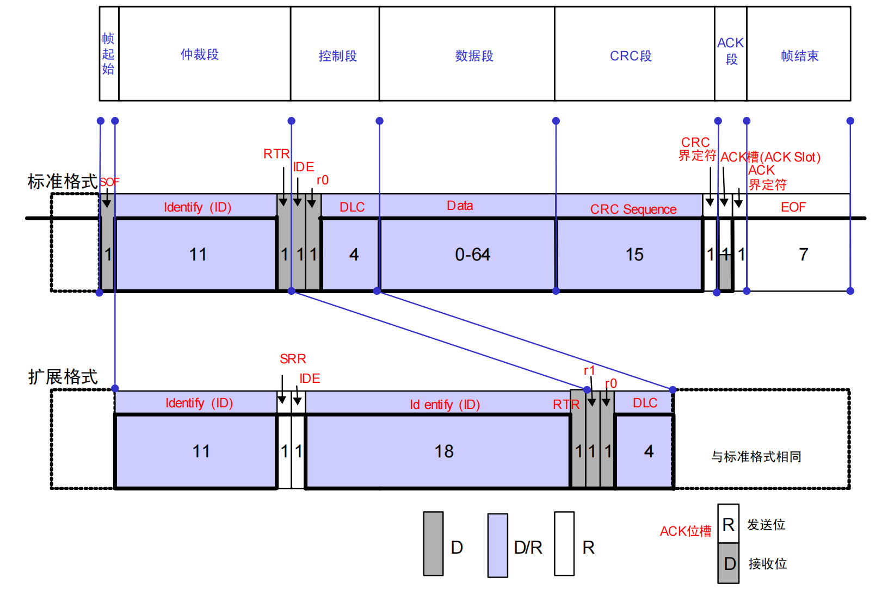
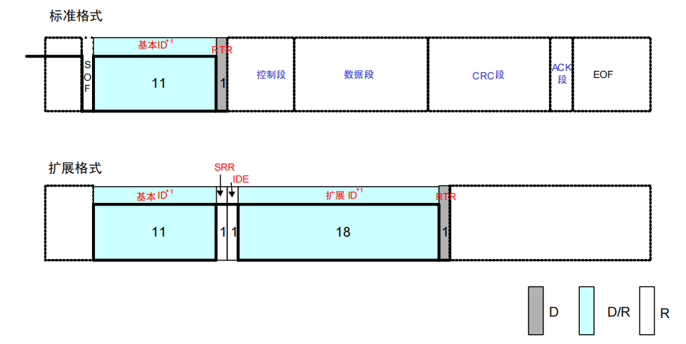
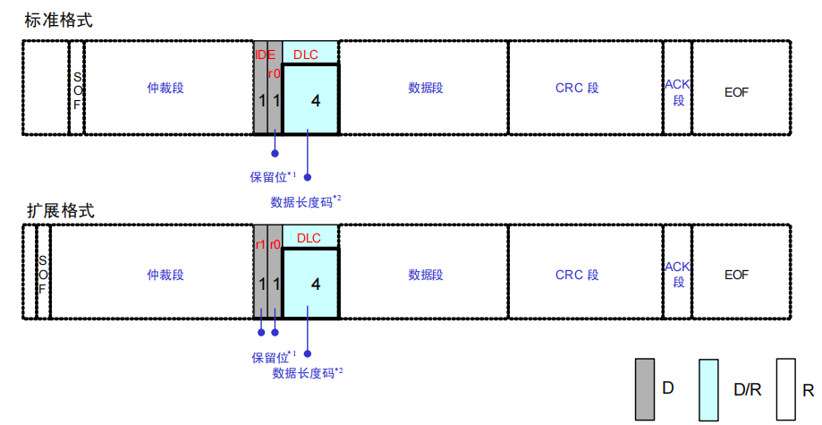
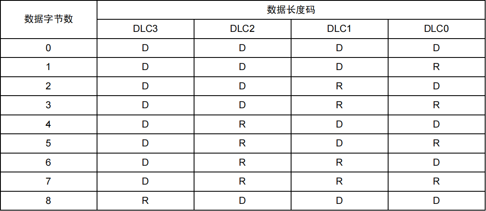
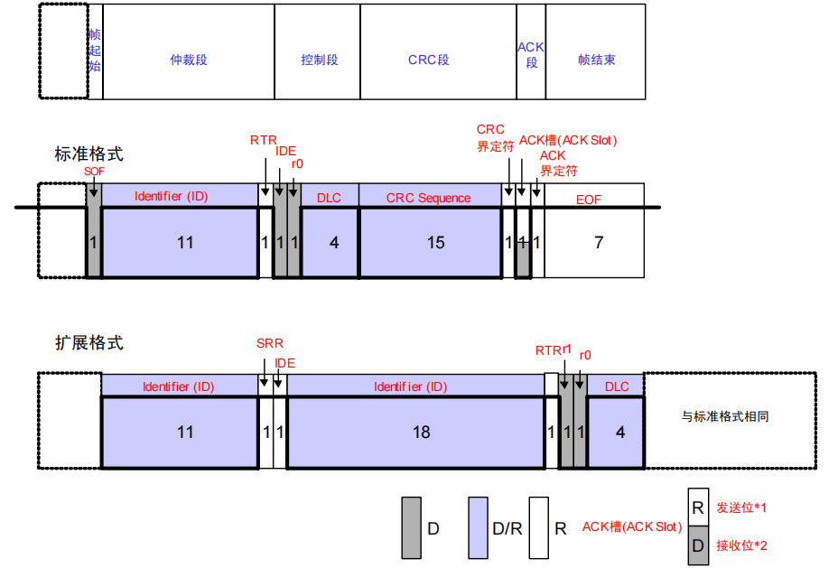
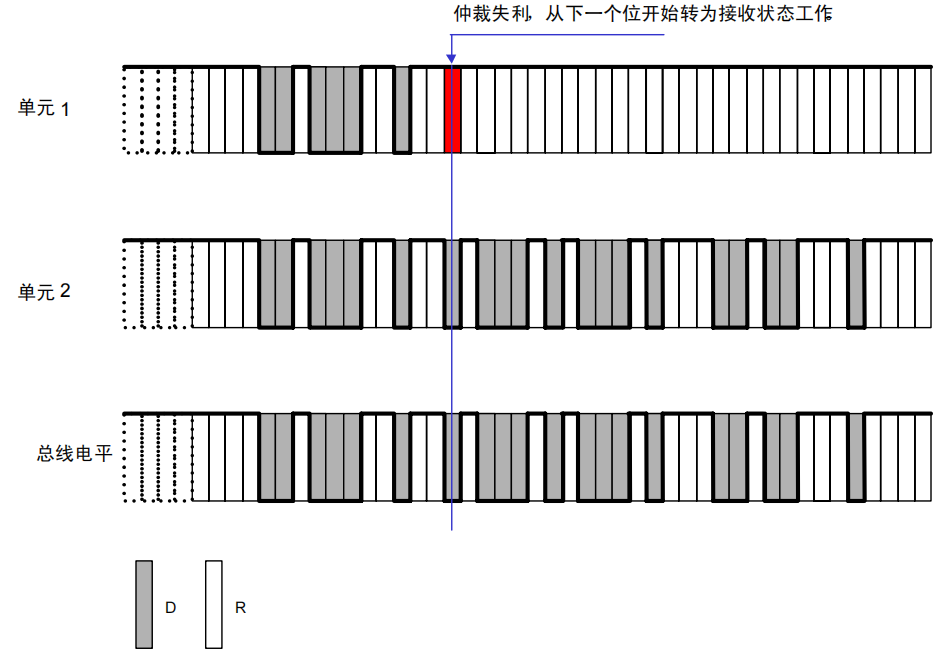

# CAN

## 特点
1. 抗干扰能力强，采用差分信号，并使用双绞线。
2. 线束量少，每个挂载设备仅需要两根线即可完成通信。
3. 通信距离长，最高可达 1km。
4. 无需共地操作，但在高干扰环境下还是需要共地来抑制共模噪声。
5. 通信速率，125kbps~1M（高速CAN）125kbps一下（低速CAN）

## CAN协议（ISO11898）

### 总线电平

总线上有**显性电平**和**隐形电平**两种

| 电平类型 | 逻辑电平 | CAN_H | CAN_L | 电压差 |
| :---| :--- |:--- |:--- | :---|
| 隐性电平 | 逻辑1 | 2.5V | 2.5V | 0V |
| 显性电平 | 逻辑0 | 3.5V | 1.5V | 2V |

当单片机通过CAN_TX发送**高电平**时，CAN总线上为**隐形电平**。

当在总线上执行线'**与**'时，只要有一个单元输出显性电平，总线上即为显性电平，只有所有单元都输出隐性电平，总线上才为隐性电平。

### 帧种类

- **数据帧**（用于发送单元向接收单元传送数据的帧）
- **遥控帧**（用于接收单元向具有相同 ID 的发送单元请求数据的帧）
- 错误帧（用于当检测出错误时向其它单元通知错误的帧）
- 过载帧（用于接收单元通知其尚未做好接收准备的帧）
- 帧间隔（用于将数据帧及遥控帧与前面的帧分离开来的帧）

错误帧、过载帧、帧间隔属于深入学习的部分，可以等遇到问题后再来学习。

### 数据帧构成

| 序号 | 帧名称 | 用途 | 
| :---| :--- | :--- |
| 1 | 帧起始 | 表示数据帧开始的段 |
| 2 | 仲裁段 | 表示该帧优先级的段 |
| 3 | 控制段 | 表示数据的字节数及保留位的段 |
| 4 | 数据段 | 数据的内容，可发送 0～8 个字节的数据 |
| 5 | CRC段 | 检查帧的传输错误的段 |
| 6 | ACK段 | 表示确认正常接收的段 |
| 7 | 帧结束 | 表示数据帧结束的段 |

**注：D为显性电平，R为隐性电平**

1.帧起始
表示帧开始的段,1位的显性位.

2.仲裁段

表示数据优先级

基本ID中禁止高7位为隐性，例如：ID=1111111XXXX.
**RTR位**为数据帧与遥控帧的判断位.
**IDE位**为标准格式和扩展格式的判断位.

3.控制段

表示数据段的字节数.

**r0、r1**为保留位,为以后协议改动预留位置所设计的.
保留位必须全部以显性电平发送,但接收方可以接收显性、隐性及其任意组合的电平。

数据长度码和字节数关系如下图所示：

4.数据段

需要发送的数据,可能包含字符0~8个字节数据.

5.CRC段

检查帧传输错误的帧

6.ACK段

由ACK槽和ACK界定符组成.
发送单元在ACK段发送2个位的隐性位,接收到正确消息的单元在ACK槽发送显性位,通知发送单元正常接收结束.

7.帧结束
表示该帧的结束,由7个位的隐形位组成.

在整个数据帧中一般由帧

### 遥控帧构成

| 序号 | 帧名称 | 用途 | 
| :---| :--- | :--- |
| 1 | 帧起始 | 表示数据帧开始的段 |
| 2 | 仲裁段 | 表示该帧优先级的段 |
| 3 | 控制段 | 表示数据的字节数及保留位的段 |
| 4 | CRC段 | 检查帧的传输错误的段 |
| 5 | ACK段 | 表示确认正常接收的段 |
| 6 | 帧结束 | 表示数据帧结束的段 |

与数据帧相比只缺少了数据段,故不作过多解释.

### 仲裁方法

在总线空闲状态下,最先开始发送消息的单元获得发送权.
当多个单元同时发送时,从仲裁段的第一位开始仲裁,连续发送显性电平多的单元可继续发送.

- 具有相同ID的数据帧和遥控帧在总线上竞争时,仲裁段的最后一位（RTR）为显性位的数据帧具有优先权,可继续发送.
- 标准格式ID与具有相同ID的遥控帧或者扩展格式的数据帧在总线上竞争时,标准格式的RTR位为显性位的具有优先权,可继续发送.
