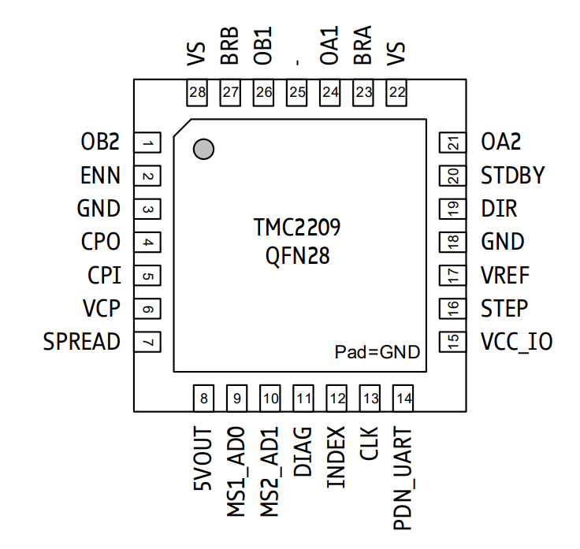

# TMC2209

## 功能与特点
1. 4.75~29V DC电压输入，2.8A峰值电流，2A RMS
2. 最高支持256细分
3. 集成脉冲发生器，可独立运动控制
4. 低RDS(on) LS&HS 170mΩ
5. 无噪音、高精度、高动态电机控制斩波器
6. 单线UART通信和高级寄存器配置
7. 全面保护和诊断

## 引脚功能与电路图设计

| 位号 | 引脚 | 功能 | 
| :---: | :---: | :--- |
| 1 | OB2   | 电机**线圈B**输出**2** |
| 2 | ENN   | 驱动使能，低电平**开启**，高电平**关闭** |
| 3 | GND | 接地 |
| 4 | CPO | 电荷泵电容输出 |
| 5 | CPI | 电荷泵电容输入 |
| 6 | VCP | 充电泵电压 |
| 7 | SPREAD | 分频器模式选择，低电平：StealthChop模式，高电平：SpreadCycle模式  |
| 8 | 5Vout | 5V输出 |
| 9 | MS1_AD0   | 微步分辨率配置  具体功能参考**表3** |
| 10 | MS2_AD1 | 对于UART配置，选择UART地址 |
| 11 | DIAG | 诊断和StallGuard输出。在检测到失速或驱动器错误时输出高电平 |
| 12 | INDEX | 可配置的索引脉冲输出 |
| 13 | CLK | 外部时钟输入 ，连接到地|
| 14 | PDN_UART | UART通信引脚 具体功能参考**表2** |
| 15 | VCC_IO | 数字引脚供电电压 3.3V到5V  |
| 16 | STEP | 步进输入  |
| 17 | VREF | 根据模拟电压的输入调节参考电流  |
| 18 | GND | 接地  |
| 19 | DIR | 步进方向控制  |
| 20 | STDBY | 备用输入 100k电阻接地 |
| 21 | OA2 | 电机**线圈A**输出**2** |
| 22 | VS | 电机供电输入 4.75-29V DC电源输入 |
| 23 | BRA | 线圈A感应电阻连接  接地用内部感应电阻 |
| 24 | OA1 | 电机**线圈A**输出**1** |
| 25 | - | 未使用的引脚 |
| 26 | OB1 | 电机**线圈B**输出**1** |
| 27 | BRB | 线圈B感应电阻连接  接地用内部感应电阻 |

**表1**

PDN_UART：待机电源关闭配置
| PDN_UART | 功能  |
| :---: | :---: | 
| GND | 在静止期间启用自动关机 | 
| VCC_IO | 不使能 | 
| UART接口 | 在作为UART通信接口时，应通过GCONF.pdn_disable=1禁用配置引脚 | 

**表2**

MS1/MS2：步进细分分辨率配置
| MS1 | MS2 | 细分设置 | UART地址 |
| :---: | :---: | :---: | :---: | 
| GND | GND | 1/8 | 0 |
| GND | VCC_IO | 1/32 | 1 |
| VCC_IO | GND | 1/64 | 2 |
| VCC_IO | VCC_IO | 1/16 | 3 |

**表3**

外围电路可参考如下设计

## UART通信配置

### 电路设计

对**不同**地址的TMC2209设备进行寄存器**读取/写入**配置可按下图进行硬件连接

对**相同**地址的TMC2209设备进行寄存器**写入**配置可按下图进行硬件连接

### UART通信

#### 写数据

每次与 TMC2209 进行数据传输之前和之后都会有一个同步字节，该字节会嵌入到首次传输的字节中，在每次传输时都允许内部波特率分频器与主时钟同步，对实际波特率进行调整，并补偿内部时钟频率的变化，因此，波特率可以在有效范围内自由选择。节点地址位通过MS1和MS2进行配置，在0~3之间选择。

| 位段 | 位名称 |
| :---: | :--- |
| 0-7 |  帧同步位 |
| 8-15 | 节点地址位  |
| 16-23 | 寄存器地址位 写数据要|0x80 |
| 24-55 | 数据位  数据从高到低排列 |
| 56-63 | CRC数据校验位  |

**表4**

#### 读数据

读数据

| 位段 | 位名称 |
| :---: | :--- |
| 0-7 |  帧同步位 |
| 8-15 | 节点地址位  |
| 16-23 | 寄存器地址位 |
| 24-31 | CRC数据校验位 |

**表5**

#### 读数据包

| 位段 | 位名称 |
| :---: | :--- |
| 0-7 |  帧同步位 |
| 8-15 | 主控地址位  接收到的数据包固定位0xFF|
| 16-23 | 寄存器地址位 |
| 24-55 | 数据位  数据从高到低排列 |
| 56-63 | CRC数据校验位  |

**表6**

#### 通信测试

为验证我们的对UART通信无误，并能够成功修改寄存器数据，我做了如下设计：

1.  读0x6C寄存器数据{05 00 6C CA} 
    接收到的数据为{05 FF 6C 15 01 00 53 A5}
    由数据包结构可知0x6C寄存器的数据默认为{15 01 00 53}

2.  写0x6C寄存器数据{05 00 EC 00 00 00 00 01 DD}（红色方框内的内容）
    
3.  读0x6C寄存器数据{05 00 6C CA} （绿色方框内的内容）
    接受到的数据为{05 FF 6C 05 00 00 01 EF}

    ————————————————————————————————

    我们可以看到0x6C寄存器数据由{15 01 00 53}变为了{05 00 00 01}
    但我们写入的时{00 00 00 01}为什么开头是05呢
    因为在硬件上我们将MS1和MS2都接地了，使得细分设置为1/8。

