# ACT部署到华为昇腾310B

## 前置条件

- Orange Pi AIpro(20T)开发板
- Windows电脑
- USB数据线

## 准备工作

### 第一步：下载balenaEtcher软件

进入[balenaEtcher官网](https://etcher.balena.io/ "balenaEtcher")

将会看到以下界面，点击红框所示的**Download Etcher**按钮

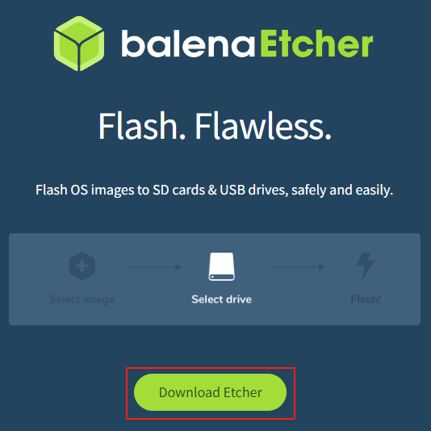

随即会跳转到以下界面，点击红框内的**Download**

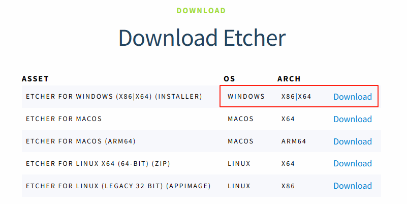

### 第二步：下载orange pi的ubuntu官方镜像

使用百度云盘下载**orange pi的ubuntu官方镜像**

链接：https://pan.baidu.com/share/init?surl=lq4cRpjmN_zWIjsY3JgXcg
提取码:2y6m

点进链接后进入到以下界面，并下载**红色方框**内Ubuntu镜像的**压缩包**

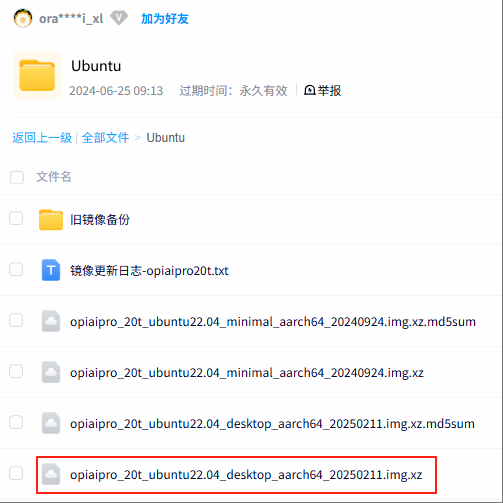

下载完毕后，解压该**压缩包**获得如图所示的Ubuntu镜像文件

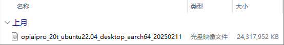

### 第三步：使用balenaEtcher烧录orange pi的ubuntu镜像到SD卡中

选择要**烧录的文件**
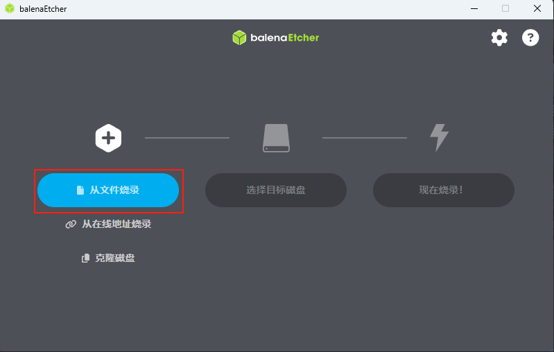

选择要烧录的**磁盘**
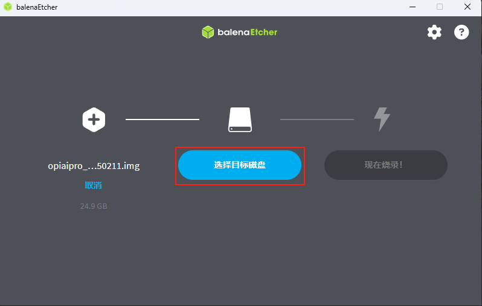

点击**现在烧录**按钮
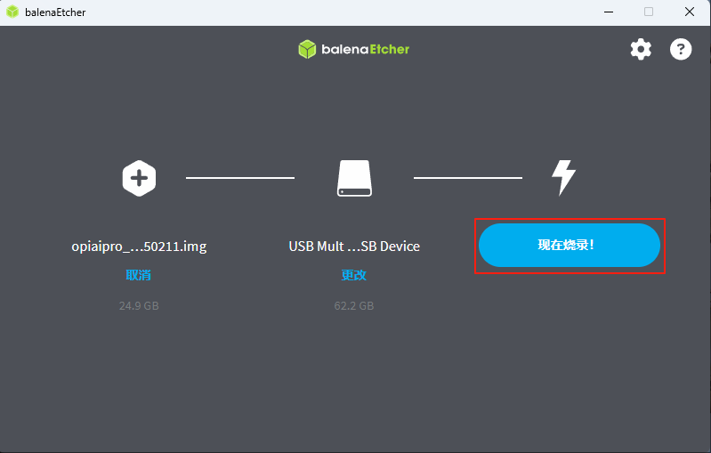

等待烧录完成
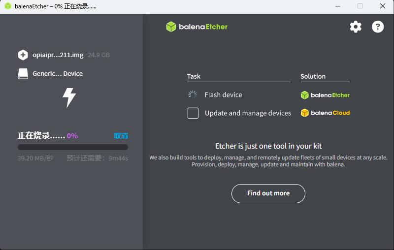

烧录完成后，将SD卡插入**Orange Pi AIpro(20T)开发板**上

## 依赖冲突

根据[lerobot官网](https://github.com/huggingface/lerobot "lerobot")所提供的信息可知，Lerobot兼容的`Python`版本如红色方框内所示

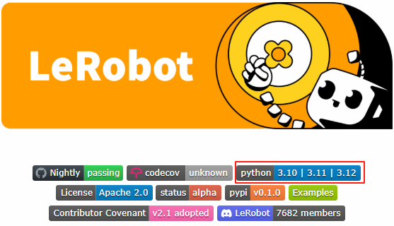

当前我们烧录的镜像中`Python`的版本如下图所示

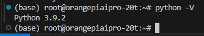

由此可知，我们需要重新安装`Python`，使其与Lerobot兼容

因为[CANN](https://www.hiascend.com/software/cann)的安装也依赖`Python`的版本，如下图所示 

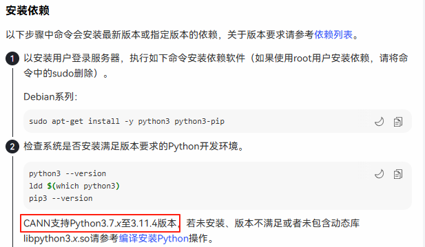

所以重新安装`Python`后，再安装`CANN`。

又因为[Ascend Extension for PyTorch](https://www.hiascend.com/software/ai-frameworks/pytorch)（即torch_npu插件）的安装依赖于`CANN`版本，所以它也需要依据`CANN`版本重装，如下图所示：

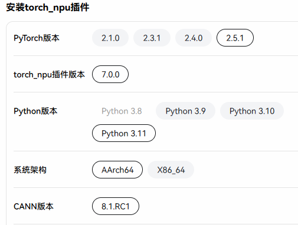

由上图可知`Ascend Extension for PyTorch`也依赖`PyTorch`版本。

而Lerobot所需的`PyTorch`版本需要>=2.2.1。由下图红色方框可知：

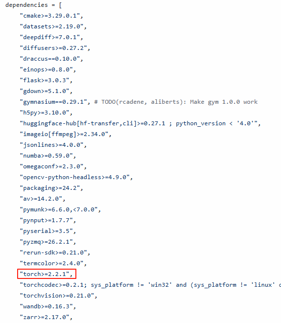

**综上所述，我们当前的环境依赖如下：**

- Lerobot
- PyTorch=2.5.1
- Python=3.11
- torch_npu=7.0.0
- CANN=8.1.RC1.beta1

## 环境搭建

### 第一步：创建虚拟环境

我们当前镜像已预安装[Conda](https://www.anaconda.com/docs/getting-started/miniconda/main)，执行如下命令创建一个新环境并激活它。

    conda create -y -n lerobot python=3.11
    conda activate lerobot

### 第二步：下载Lerobot源码并应用补丁

执行以下命令下载Lreobot源码和补丁文件。

    git clone https://github.com/huggingface/lerobot.git
    git clone https://github.com/hexchip/lerobot-on-ascend.git

进入lerobot目录。

    cd lerobot

检出到特定的历史时刻。（我们是基于这个历史时刻进行开发的）

    git checkout a445d9c9da6bea99a8972daa4fe1fdd053d711d2 

应用git补丁。

    git apply ../lerobot-on-ascend/Ascend_Lerobot.patch

### 第三步：安装所需的包和依赖

因为Lerobot需要ffmpeg包的支持，所以先安装它，执行以下命令：

    conda install -y ffmpeg -c conda-forge

安装Lerobto所需的依赖。

    pip install -e ".[feetech]"

安装CANN的依赖

    pip install -r ../lerobot-on-ascend/requirements.txt

前往[昇腾资源下载中心](https://www.hiascend.com/developer/download/community/result?module=cann&cann=8.1.RC1.beta1)，下载下图所示的软件包。

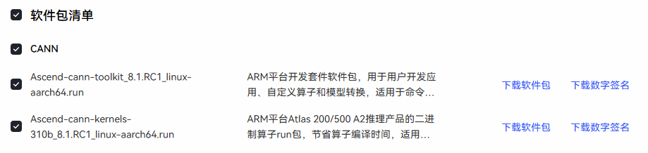

执行以下命令，安装依赖

下载完成后，把安装包拷贝到当前（lerobot）目录，执行以下命令：

1. 给予toolkit安装包执行权限。  

        chmod +x ./Ascend-cann-toolkit_8.1.RC1_linux-aarch64.run
2. 安装toolkit。  

        ./Ascend-cann-toolkit_8.1.RC1_linux-aarch64.run --install

    安装完成后，如下所示：
    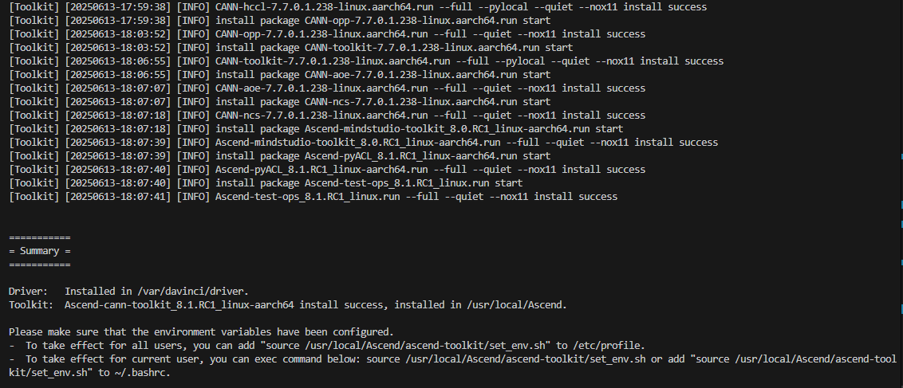

3. 给予Kernels安装包执行权限。  

         chmod +x Ascend-cann-kernels-310b_8.1.RC1_linux-aarch64.run

4. 安装Kernels。  

         ./Ascend-cann-kernels-310b_8.1.RC1_linux-aarch64.run --install

安装完成后，如下所示：

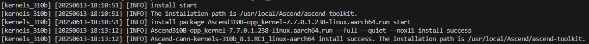

更多安装细节请参考[官方文档](https://www.hiascend.com/document/detail/zh/CANNCommunityEdition/81RC1beta1/softwareinst/instg/instg_0008.html?Mode=PmIns&InstallType=local&OS=Ubuntu&Software=cannToolKit)。

执行以下命令安装torch_npu。

    pip install torch-npu==2.5.1

更多`Ascend Extension for PyTorch`细节请参考[官方仓库](https://gitee.com/ascend/pytorch)。

## 机械臂配置和部署

### 第一步：端口匹配

执行以下命令，根据终端提示，拔掉任一USB数据线后按下回车，即可在终端打印出被拔掉数据线的端口号

        python lerobot/scripts/find_motors_bus_port.py

前往`lerobot/common/robot_devices/robots`路径下打开`configs.py`文件，依据个人所组装的机械臂型号更新端口号。如下图红色方框所示：

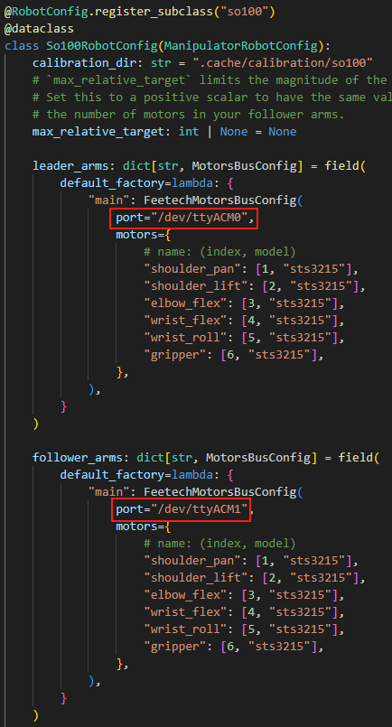

### 第二步：配置舵机ID

将舵机与控制板连接，执行以下命令，即可为连接的舵机配置ID号为`1`，并设置当前位置为`2048`（位置中值）。

    python lerobot/scripts/configure_motor.py \
       --port /dev/ttyACM0 \
       --brand feetech \
       --model sts3215 \
       --baudrate 1000000 \
       --ID 1

修改`--ID`参数依次为电机配置ID号，直至到`6`

### 第三步：组装机械臂

具体组装细节请参考[Hugging Face官网](https://huggingface.co/docs/lerobot/so100#first-motor)

### 第四步：标定机械臂

执行以下命令。

    python lerobot/scripts/control_robot.py \
      --robot.type=so100 \
      --robot.cameras='{}' \
      --control.type=calibrate

按照提示摆好对应动作后点击`Enter`。

#### 手动校准Follower_Arm

 | follower_middle | follower_zero | follower_rotated | follower_rest |
 |------|------|------|------|
 |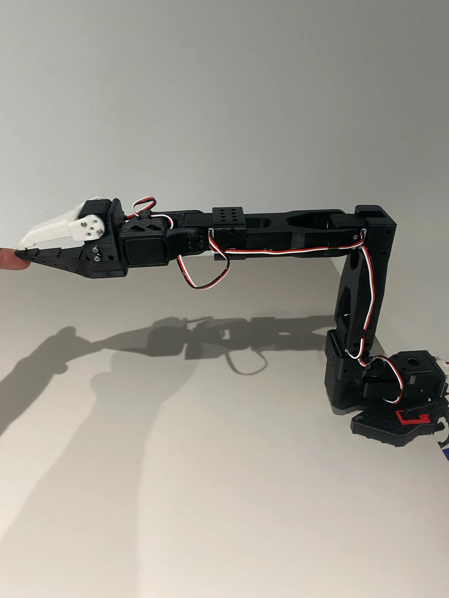|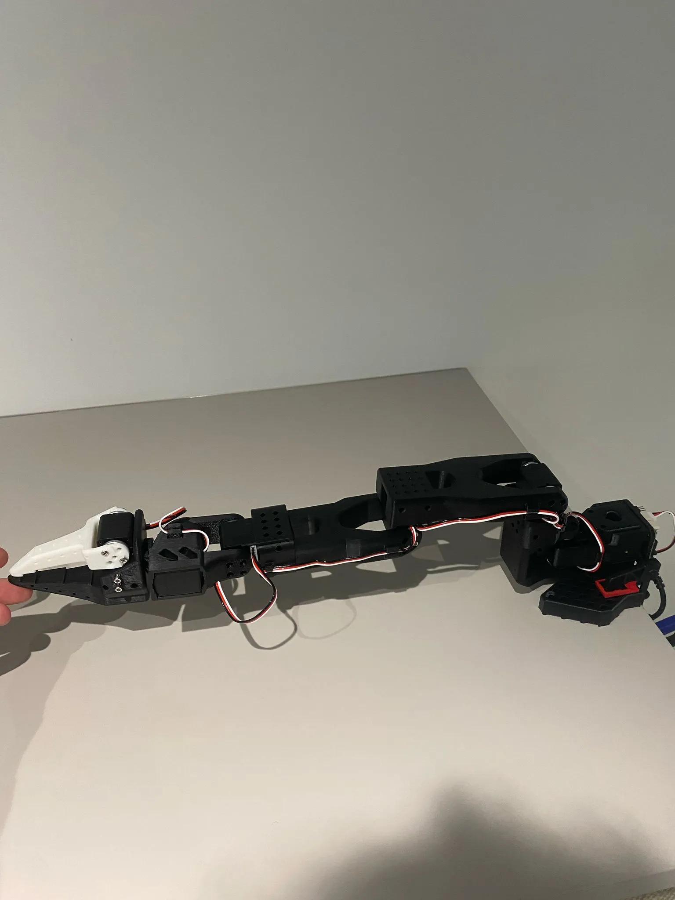|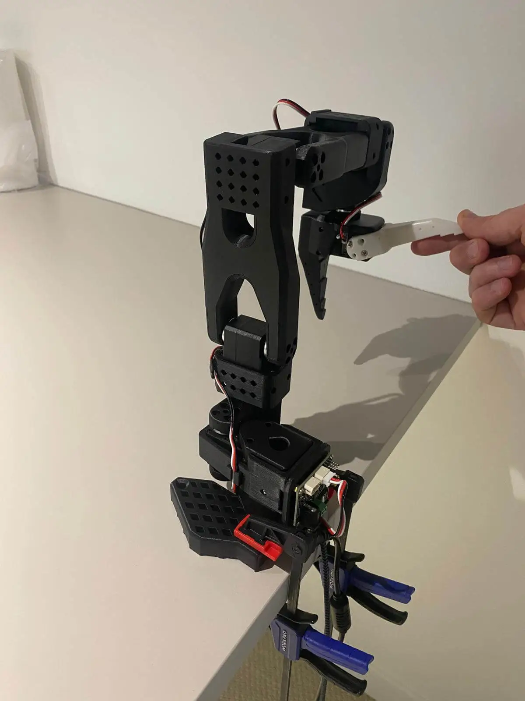|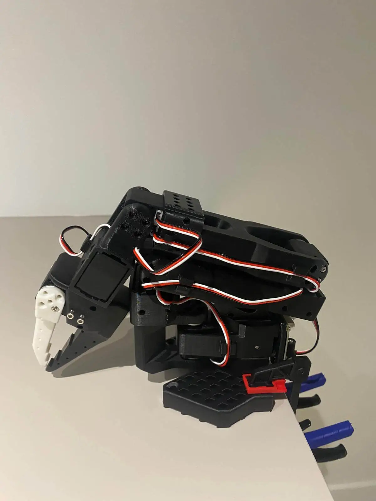|

#### 手动校准Leader_Arm

 | leader_middle | leader_zero | leader_rotated | leader_rest |
 |------|------|------|------|
 |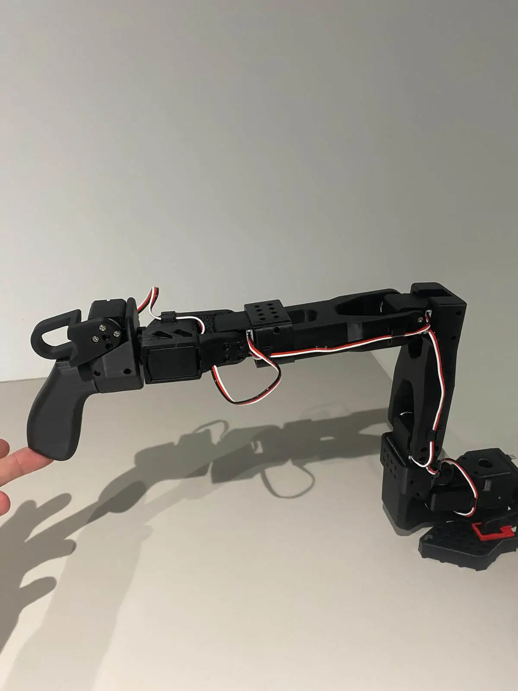|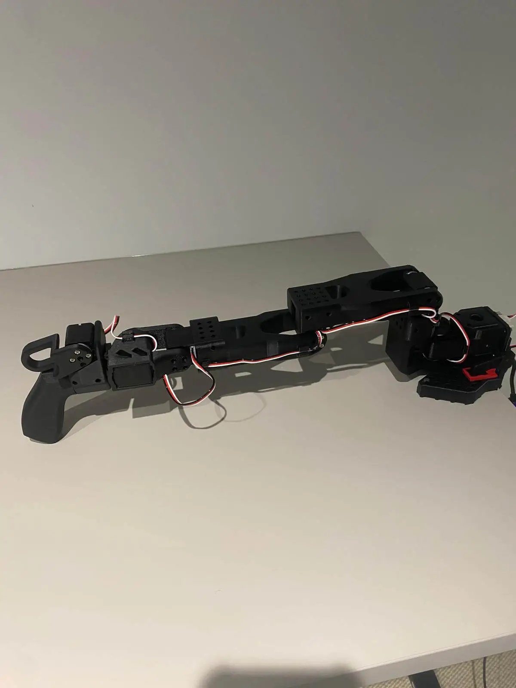|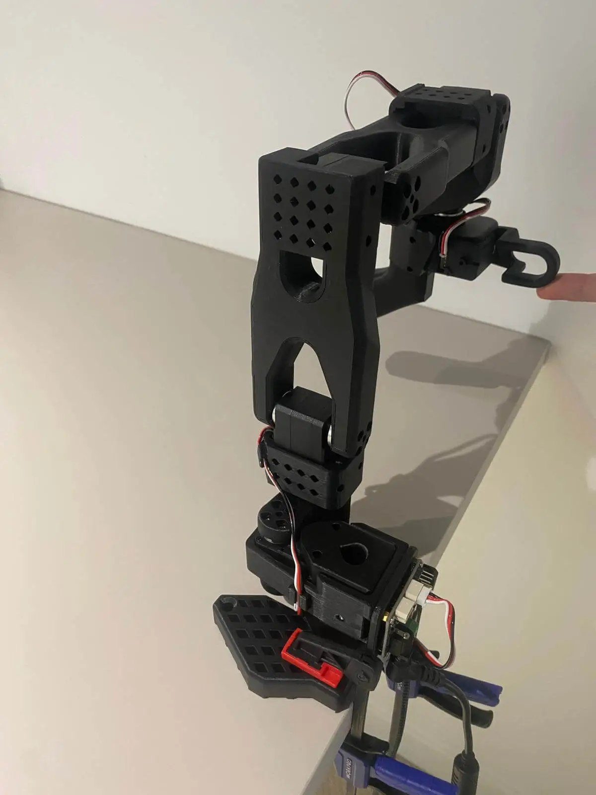|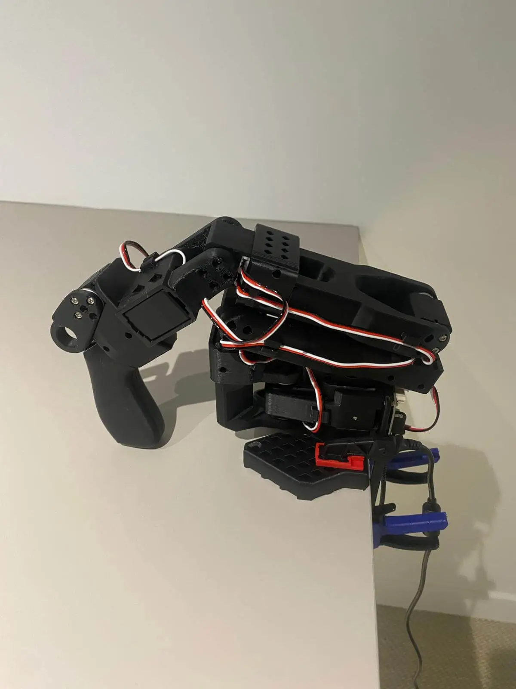|

### 第五步：遥操作

执行以下命令，可开启遥操作并在屏幕上显示摄像头画面。

    python lerobot/scripts/control_robot.py \
      --robot.type=so100 \
      --control.type=teleoperate \
      --control.display_data=true 

若仅开启遥操作，可执行以下命令：

    python lerobot/scripts/control_robot.py \
      --robot.type=so100 \
      --robot.cameras='{}' \
      --control.type=teleoperate

后续模型训练和推理以及更多细节可参考`examples`目录下的`10_use_so100.md`文件
